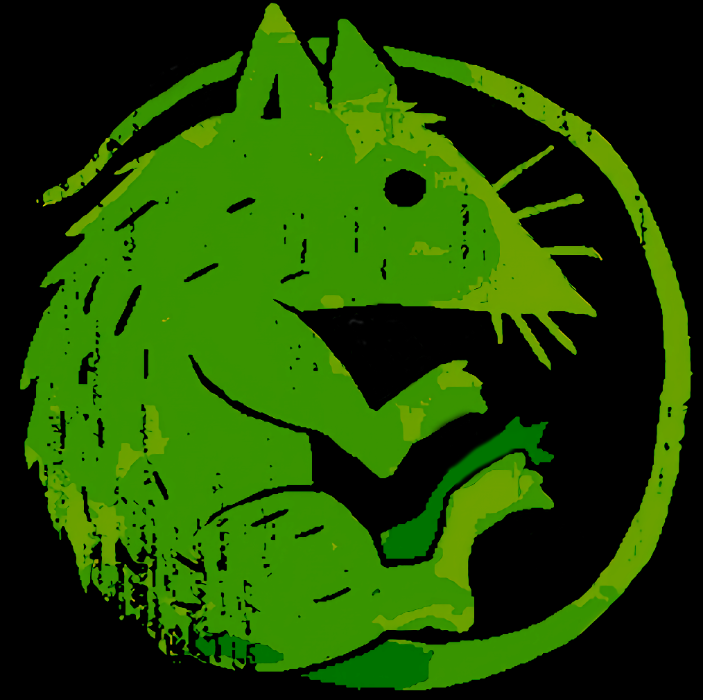

#  Sam Lazrak

---

Hey there! I'm Sam Lazrak. (he/him)

Welcome to my little corner of the internet! I'm interested in infrastructure (both community and software), cognitive systems, and ethical tech. Currently, I'm based in Birmingham, Alabama studying Computer science and Philosophy at uab.

**I have made a few coding projects in my life:**

- [Go rest api w/ jwt auth](https://github.com/samlazrak/go-rest-api-jwt)
- [Anycubic Kossel Linear Plus docs](https://github.com/samlazrak/Anycubic-Kossel-Linear-Plus)
- [Vscode theme inspired by plants](https://github.com/samlazrak/vegetation)
- [Resume](SamLazrakResume.pdf)
- [CV](SamLazrakCV.pdf)

Apart from coding and such, I have a [digital garden](https://garden.samlazrak.com) where I have public research notes!

I also create [art](https://instagram.com/thesunflowerrat) exploring the liminal space of creativity, sunflowers, space, emptiness, and wabi sabi.

Copyright (©) 2021 Sam Lazrak @ Samlazrak.com - All rights reserved
